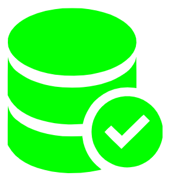

# Test Database for SQL Server using Docker

A real SQL Server database running on docker for your unit tests.

Published at https://www.nuget.org/packages/TestDatabase.SqlServerDocker/

See examples at https://github.com/benrobot/TestDatabase.Sample
